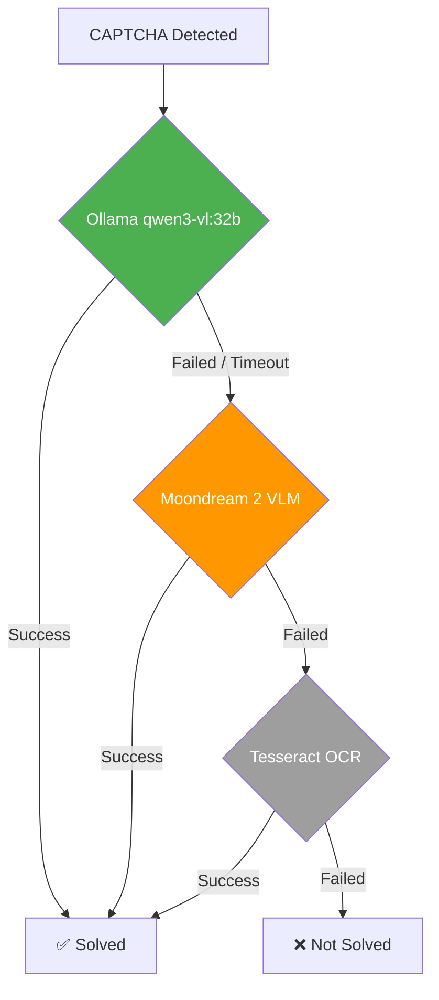

# CAPTCHA Solver — Fallback Architecture

## Overview

The CAPTCHA solving system utilizes a three-tier fallback chain to maximize the success rate across various CAPTCHA types (Text, Grid, Math, Slider).

## Fallback Chain



## Model Comparison

| Feature | Ollama (qwen3-vl:32b) | Moondream 2 | Tesseract OCR |
|---------|-----------------------|-------------|---------------|
| **Type** | Vision LLM (remote) | Vision LLM (local) | Classic OCR |
| **Model Size** | ~20 GB | ~3.7 GB | <100 MB |
| **Inference Time**| ~1–5 s (GPU) | ~3–10 s (CPU) | ~0.5 s |
| **Infrastructure**| SSH Tunnel to Server | Local in Docker Container | System Package |
| **Text CAPTCHA** | ★★★★★ | ★★★★☆ | ★★☆☆☆ |
| **Grid CAPTCHA** | ★★★★☆ | ★★★☆☆ | ✗ |
| **Math CAPTCHA** | ★★★★★ (Regex first) | ✗ | ✗ |
| **Slider CAPTCHA** | ★★★☆☆ | ✗ | ✗ |
| **Availability** | SSH Tunnel Required | Always Available | Always Available |

## When is the Fallback Triggered?

A fallback to the next tier occurs when:

1. **Ollama is unreachable** — Server offline, SSH tunnel inactive, Timeout
2. **Ollama answers, but empty** — Model returns no alphanumeric characters
3. **Moondream returns no valid solution** — Empty response or exception
4. **Moondream is disabled** — `MOONDREAM_MODEL=""` → falls back directly to Tesseract

## Lazy-Loading

Moondream 2 is **not loaded on startup**, but only on the first fallback call:

```python
class MoondreamSolver:
    _model = None  # No model on startup

    @classmethod
    def _load_model(cls, model_id, device):
        if cls._model is not None:
            return  # Already loaded
        # The model is downloaded (~3.7 GB) and loaded into memory here
        cls._model = AutoModelForCausalLM.from_pretrained(model_id, ...)
```

→ If Ollama always works, Moondream is **never loaded** and consumes zero resources.

## Docker Integration

```yaml
# docker-compose.yml
collector:
  environment:
    MOONDREAM_MODEL: vikhyatk/moondream2
    MOONDREAM_DEVICE: cpu
    HF_HOME: /app/.cache/huggingface   # Cache directory
  volumes:
    - huggingface_cache:/app/.cache/huggingface  # Persistent cache
```

The model is downloaded on the first fallback call and stored in the `huggingface_cache` volume. It doesn't need to be redownloaded upon container restarts.

## Logging Format

All solver results are logged in a structured format:

```
[CAPTCHA/TEXT] solver=ollama model=qwen3-vl:32b result='ABC123' length=6
[CAPTCHA/TEXT] solver=moondream model=vikhyatk/moondream2 result='ABC123' length=6
[CAPTCHA/GRID] solver=ollama model=qwen3-vl:32b cells=[0, 3, 7] count=3
```

## Configuration

### Per Forum (forums.yaml)

```yaml
captcha_config:
  ollama_model: "qwen3-vl:32b"
  moondream_fallback: true    # Enable/Disable Moondream Fallback
```

### Global (Environment Variables)

```bash
MOONDREAM_MODEL=vikhyatk/moondream2   # Empty = disabled
MOONDREAM_DEVICE=cpu                   # cpu or cuda
```

## File Structure

```
collectors/
├── captcha_solver.py          ← MoondreamSolver + Fallback Chain
├── account_generator.py       ← Forwards Moondream-Config to CaptchaSolver
├── config/forums.yaml         ← moondream_fallback per Forum
├── .env / .env.example        ← MOONDREAM_MODEL, MOONDREAM_DEVICE
└── tests/
    └── test_captcha_moondream.py  ← 18 Unit-Tests (Mock-based)
```
