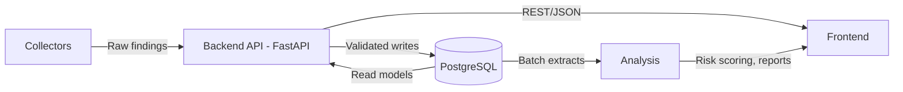

# System Architecture Overview

## Context

The system is organized as modular components that isolate collection, API orchestration, storage, and analytics responsibilities.

## High-Level Diagram

## Module Responsibilities

### Collectors

- Inputs: source URLs, crawling schedules, TOR/network settings.
- Outputs: raw finding payloads with metadata (source, timestamp, URL, content body/hash candidate).

### Backend (FastAPI)

- Inputs: HTTP requests from frontend and collectors.
- Outputs: validated API responses and normalized database records.
- Responsibilities:
- Request validation (Pydantic schemas).
- CRUD and workflow orchestration.
- Health and operational endpoints.

### Database (PostgreSQL)

- Inputs: normalized entities from backend.
- Outputs: persistent records for API and analysis reads.
- Responsibilities:
- Referential integrity with foreign keys.
- Indexed query paths for hash lookups and time-window queries.

### Analysis

- Inputs: historical records from PostgreSQL.
- Outputs: risk indicators, aggregated insights, trend summaries.

### Frontend

- Inputs: backend APIs and analysis outputs.
- Outputs: analyst-facing dashboards and triage views.

## Data Flow

1. Collectors ingest source data and submit findings.
2. Backend validates payloads and persists normalized entities.
3. PostgreSQL stores entities with relational links and indexes.
4. Analysis jobs process records for trend/risk outputs.
5. Frontend retrieves data through backend APIs.

## Technology Decisions

- FastAPI: chosen for high developer velocity, async support, and automatic OpenAPI docs.
- PostgreSQL: chosen for relational consistency, strong indexing support, and robust query planning.
- SQLAlchemy: chosen for explicit schema modeling and migration-friendly metadata.
- Alembic: chosen to version schema evolution and support predictable deployment rollouts.
- Docker Compose: chosen for consistent local development across team members.